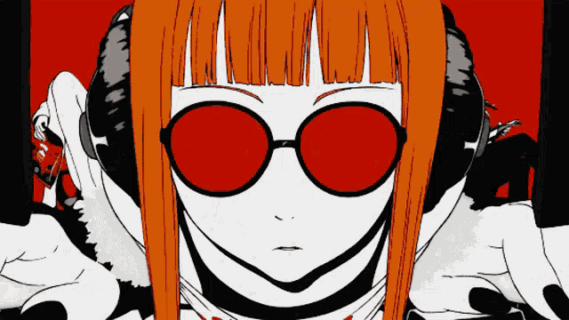

# Hi there, I'm Alex 👋 

  

## 🚀 Aspiring Software Engineer | B.S. CS & AI Student (Maestro Univ '26)
I'm a developer strictly focused on building. No matter the language or difficulty, I strive to be the best I can be.

---

### 🛠️ Currently Under Development...
I’m currently deep-diving into the "Metal" of software and the "Logic" of game design.

<table align="center">
  <tr>
    <td align="center" width="200">
      
       <b>Low-Level</b> C++, OpenGL 3D
    </td>
    <td align="center" width="200">
      
       <b>Game Dev</b> GDScript & Engine Architecture
    </td>
    <td align="center" width="200">
      
       <b>Automation & AI</b> Python & Scripting
    </td>
    <td align="center" width="200">
      
       <b>Web Stack</b> Next.js & Supabase
    </td>
  </tr>
</table>

---

  

  

